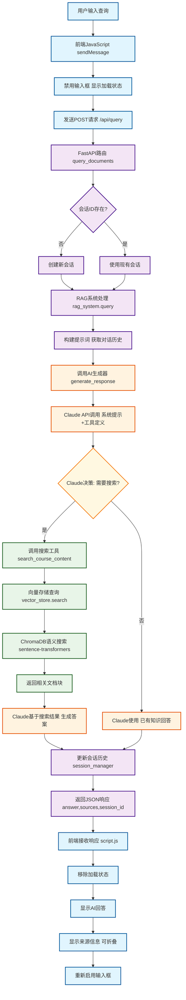

# RAG系统查询流程图

## 主要组件说明

### 🖥️ 前端层 (Frontend)
- **用户界面**: HTML/CSS/JavaScript
- **状态管理**: 会话ID、加载状态、消息历史
- **HTTP通信**: Fetch API与后端交互

### 🔧 FastAPI层 (API Layer)  
- **路由处理**: `/api/query` 端点
- **请求验证**: Pydantic模型验证
- **会话管理**: 创建/维护用户会话

### 🧠 RAG系统核心 (RAG Core)
- **查询编排**: 协调各个组件
- **上下文管理**: 对话历史和会话状态
- **AI集成**: Claude API调用

### 🤖 AI处理层 (AI Layer)
- **智能决策**: 判断是否需要搜索
- **工具使用**: 调用搜索工具获取信息
- **答案合成**: 基于搜索结果生成回答

### 🗄️ 数据存储层 (Storage Layer)
- **向量数据库**: ChromaDB存储文档嵌入
- **语义搜索**: sentence-transformers模型
- **文档检索**: 相关内容块匹配

## 数据流

1. **用户查询** → HTTP POST请求
2. **API验证** → 会话管理
3. **RAG处理** → AI生成器调用  
4. **Claude决策** → 工具使用/直接回答
5. **搜索执行** → 向量相似度匹配
6. **答案生成** → 上下文增强响应
7. **前端展示** → 用户界面更新